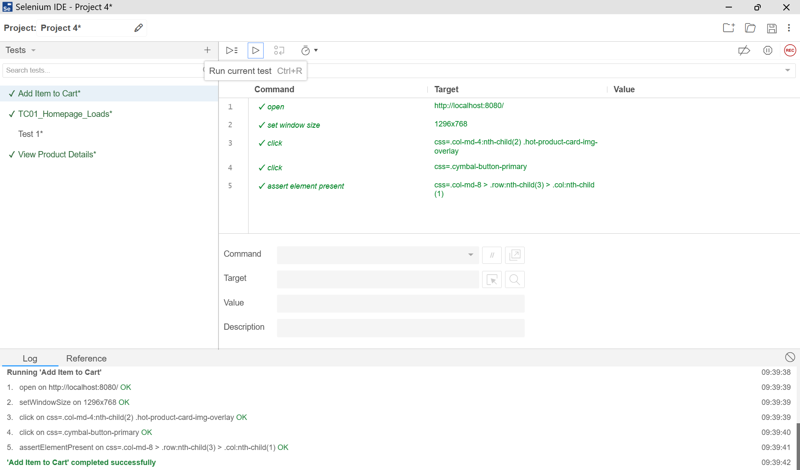

Week 8 Final Presentation – Software Testing Portfolio 

 

Presenter: Anusha Reddy 

Course: MSSE 640 Software Quality and Test 

Professor: Randall Granier 

 Worked: Individually (with AI‑assisted workflows) 

## 1. Target Testing Applications 

1.1 What I Built 

Across the semester, I created four different testing applications: 

Unit Testing App (Project 1) 

 A small module with functions for validation and arithmetic logic. 

 Used for Sunny/Rainy Day tests, boundary values, and equivalence classes. 

Postman API Test Suite (Project 2) 

 CRUD operations, schema validation, environment variables, and negative tests. 

JMeter Load Test (Project 3) 

 Simulated concurrent users to measure throughput, latency, and error rate. 

Selenium UI Test on Localhost (Project 4) 

Automated login flow on the scaffolded Online Boutique app running locally at http://localhost:8080. 

 

1.2 How I Coded It 

Languages/Tools: JavaScript/Python, Postman, JMeter, Selenium IDE + WebDriver 

Localhost Setup: Online Boutique scaffold running at http://localhost:8080 

Version Control: GitHub 

Execution: Local machine + Replit for quick prototyping 

1.3 AI Tools Used 

I used Agentic AI tools (ChatGPT, GitHub Copilot, Replit AI) for: 

Generating initial test scaffolds 

Creating boundary value and pairwise tests 

Debugging Selenium selectors 

Explaining JMeter performance graphs 

Writing Markdown documentation 

AI accelerated development, but I validated all outputs manually. 

1.4 Screenshot of One Application 

2. Summary of Results from All 4 Assignments 

Project 1 – Unit Testing 

Built a small module with multiple functions 

Created Sunny Day and Rainy Day tests 

Applied boundary value analysis and equivalence classes 

Achieved full test coverage 

AI helped generate edge‑case scenarios 

 

Project 2 – Postman API Testing 

Built a full Postman collection with CRUD tests 

Added schema validation and negative tests 

Used environment variables and pre‑request scripts 

AI helped generate assertions and test logic 

 

Project 3 – JMeter Performance Testing 

Created a Thread Group simulating concurrent users 

Added HTTP Samplers, Assertions, and Listeners 

Measured response time, throughput, and error rate 

AI helped interpret performance graphs 

 

Project 4 – Selenium UI Testing (Localhost) 

Tested the Online Boutique app running locally 

Automated login flow using Selenium IDE 

Exported to WebDriver code 

Added waits, assertions, and reusable functions 

AI helped debug selectors and refactor code 

3. Summary of One Test (Instead of Demo) 

Selenium Test – Add Item to Cart (Example Scenario) 

Here is a clear summary of one of the Selenium tests I created for the Online Boutique application running on localhost. 

This test validates the Add to Cart functionality. 

What the Test Does 

Opens the browser 

Navigates to http://localhost:8080 

Clicks on a product to view its details 

Clicks Add to Cart 

Opens the cart page 

Verifies the item appears in the car 

 

## 4. Analysis of Agentic AI Coding Tools 

4.1 Pros of Agentic AI Tools in Testing 

Rapid generation of boundary values and test cases 

Debugging support for selectors, logs, and errors 

Faster learning curve for tools like JMeter and Selenium 

Automatic documentation and Markdown generation 

Great for scaffolding and refactoring 

4.2 Cons / Limitations 

AI sometimes hallucinates selectors or endpoints 

May generate test cases that fail at runtime 

Doesn’t understand domain‑specific edge cases 

Can produce inconsistent code unless reviewed 

4.3 Real Examples from This Class 

Selenium: AI suggested CSS selectors that didn’t exist → required manual correction 

Postman: AI referenced undefined variables in test scripts 

JMeter: AI misinterpreted performance graphs until I provided raw numbers 

Unit Tests: AI missed invalid negative inputs until I added them manually 

4.4 Special Considerations for Testing 

AI should accelerate, not replace, human validation 

Testers must verify every selector, assertion, and test case 

Security and negative tests should never rely on AI guesses 

AI is best for scaffolding, not final production tests 

## 5. Closing Summary 

Built four testing applications across unit, API, performance, and UI testing 

Used AI responsibly to accelerate development 

Validated all outputs manually 

Learned how AI supports—but does not replace—software testers 

Ready to present live using this Markdown file 

 

 

 